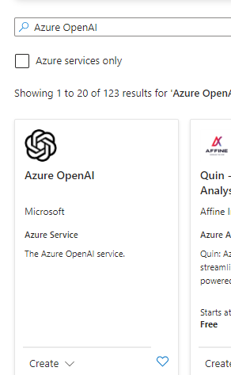
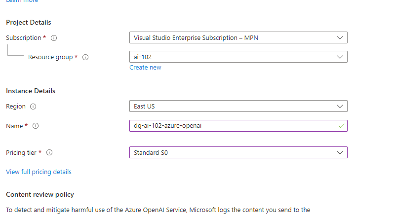
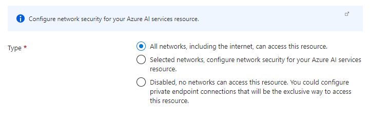

# Access Azure OpenAI Service

## create the resource

-- name must be unique per region







## Create in CLI

```
az cognitiveservices account create \
-n MyOpenAIResource \
-g OAIResourceGroup \
-l eastus \
--kind OpenAI \
--sku s0 \
--subscription subscriptionID
```

certain models might not be available in certain regions