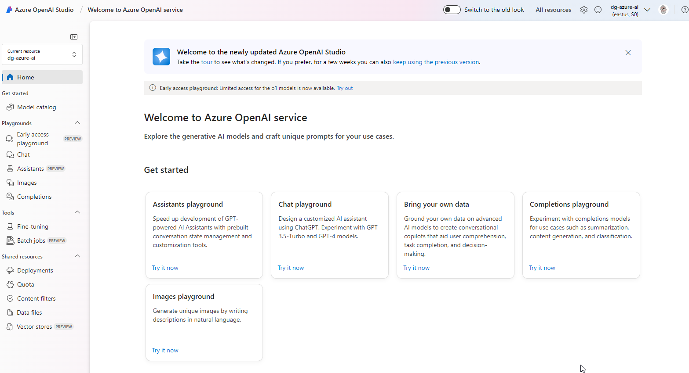
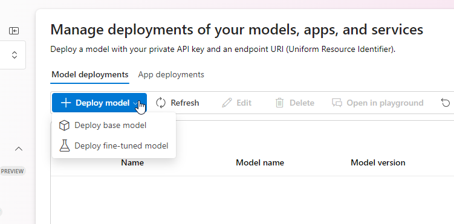
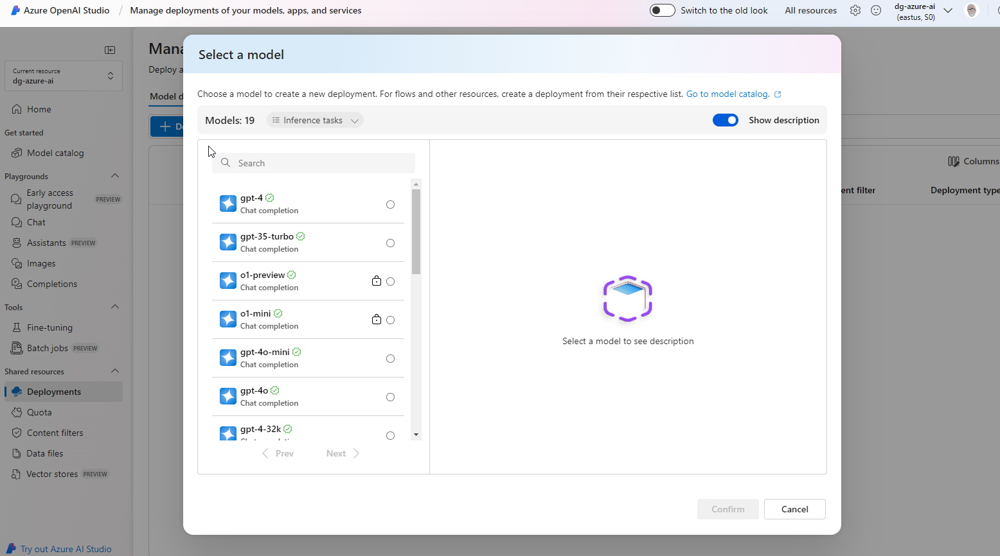
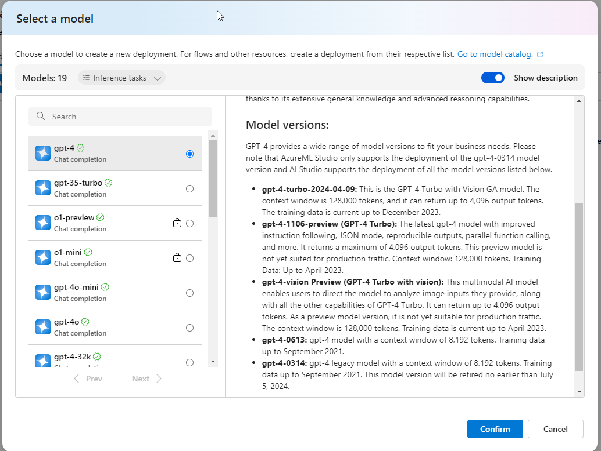
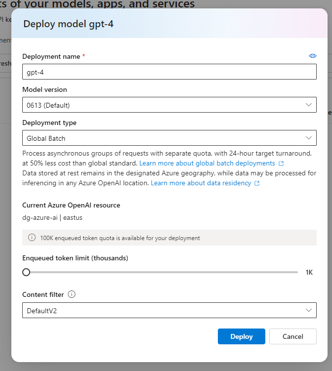
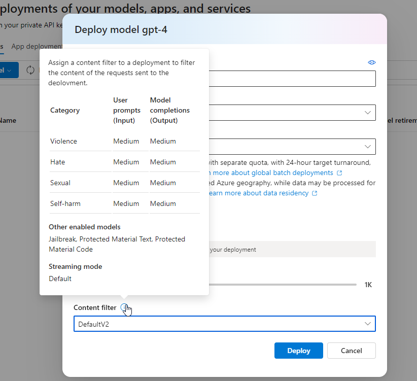
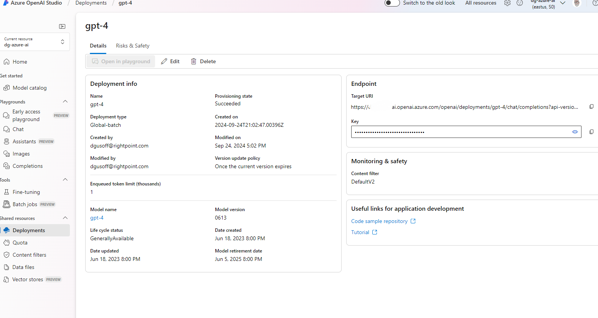

# use azure open ai studio



## deploy a model













## types of generative AI models

* GPT-4 latest generative pretrained (GPT)
* GPT 3.5 and GPT-35-turbo optimized for chat based interactions
* embeddings models - convert text into numeric vectors, useful in language analytics
* DALL-E used to generate images. don't need ot be explicitly deployed

## model catalog
* list base models and customized models by fine tuning base models
* Succeeded mean successfully trained and deployable
* there are other types of models as well

# Deploy

## using CLI

```
az cognitiveservices account deployment create \
   -g OAIResourceGroup \
   -n MyOpenAIResource \
   --deployment-name MyModel \
   --model-name gpt-35-turbo \
   --model-version "0301"  \
   --model-format OpenAI \
   --sku-name "Standard" \
   --sku-capacity 1
```

## using REST

look at documentation

https://learn.microsoft.com/en-us/azure/ai-services/openai/

