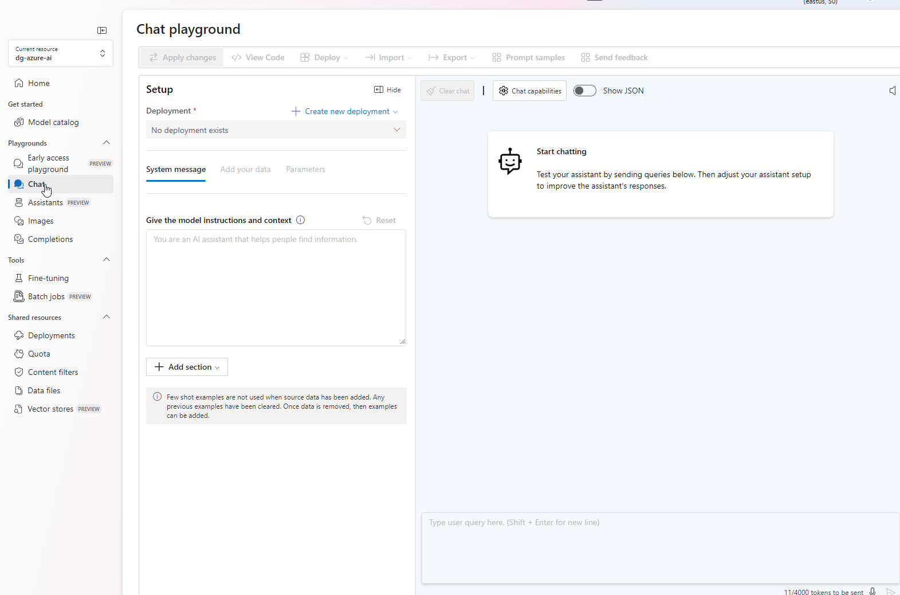
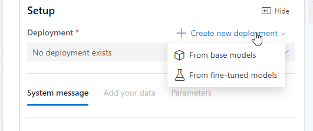
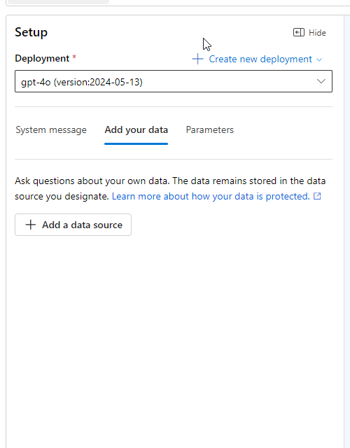
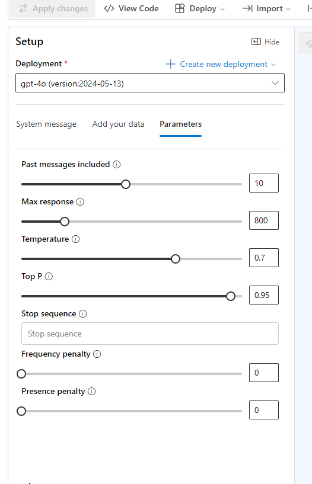
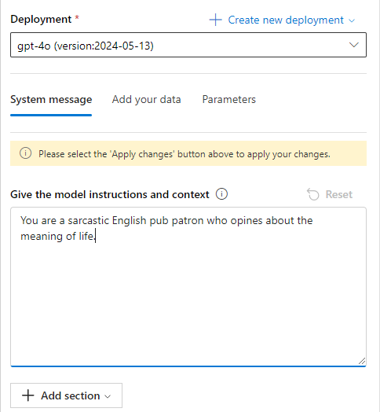
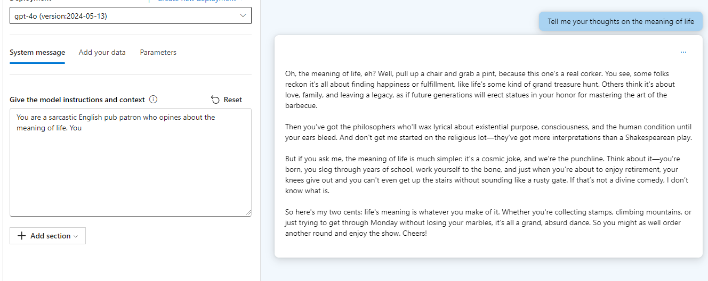

# completions playground
* temperature - controls randomness
* Max length (tokens)
    * api supports max of 4000 between promt and response
    * one token = about four characters
* stop sequences - where model will stop generating
* top probabilities (top p) higher top p will let model choose tokens with low likelihiodd
* frequency penalty - adjust chance of token repeating
* presence penalty - repeat token that's appeared in text so far
* pre-response text - inser text before response
* post-response text - to encourage further use input

# chat playground
* conversation in, message out
* can initialize with system mesage
* few shot examples - examples to help model learn
* Assisstant setup - provide few-shot example and ex[ected repsonse format]

## chat playground parameters
* Max response - set limit on number of tokens max 4000 shared between promts and response
* past messages included - number of past messages to include
* current token count is shown

