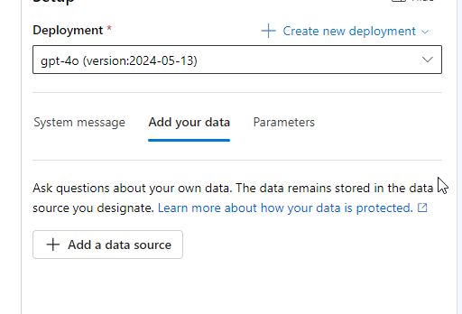
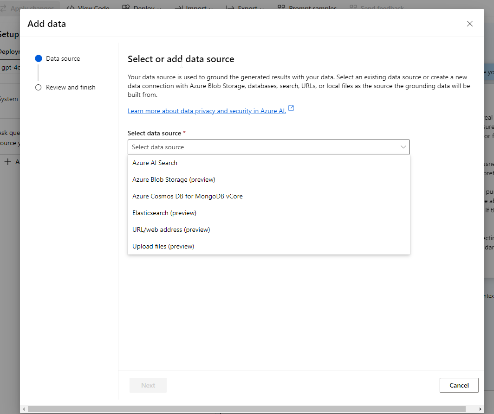
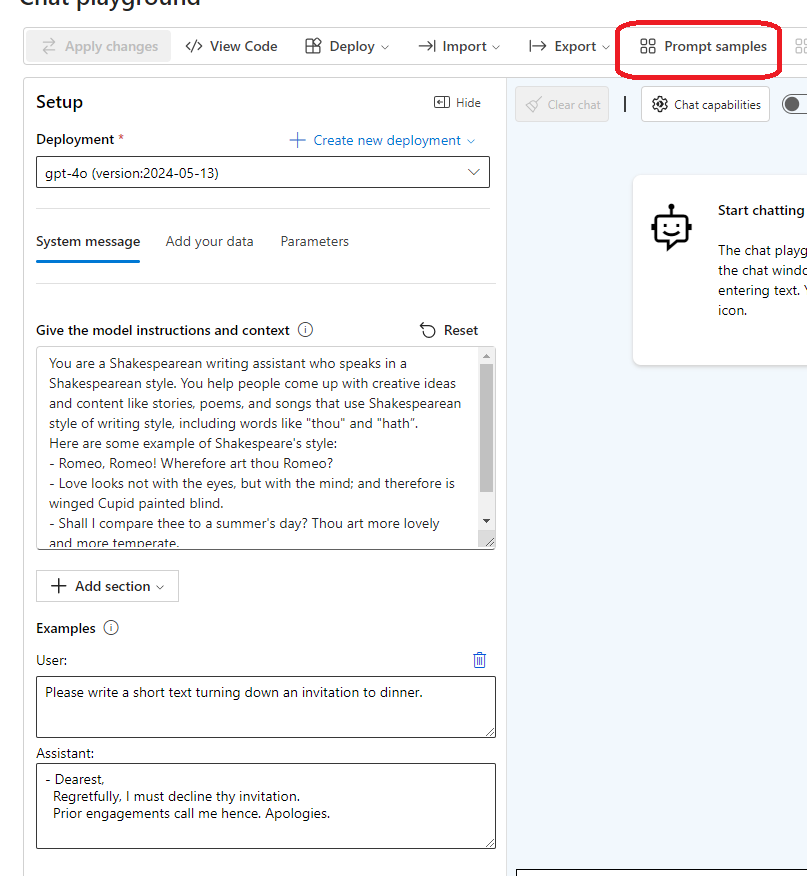
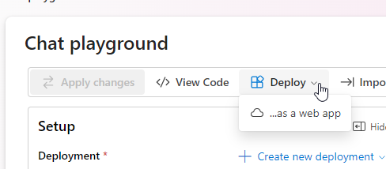
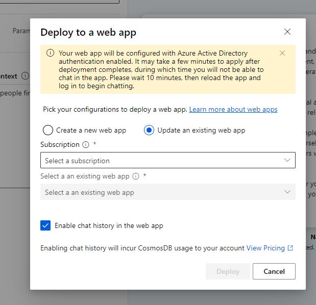

# Exercise - Get started with Azure OpenAI Service

https://microsoftlearning.github.io/mslearn-openai/Instructions/Exercises/01-get-started-azure-openai.html

## create an openai resource

## deploy a model

## use the chat playground

## experiment with system messages, promts, and few-shot examples

## experiment with parameters

## deploy to web app

